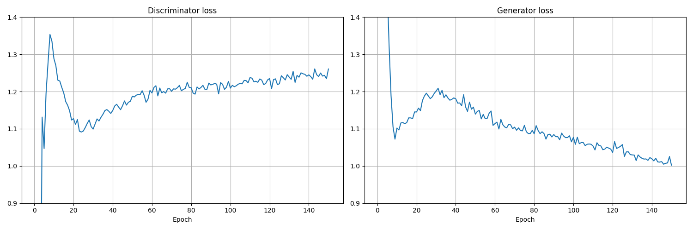

# GAN: Generative Adversarial Networks

## Evaluation

### Loss

### Discriminator Loss

### Discriminator Accuracy

### Generated images while training
The GAN was trained for 150 epochs:
Each column represents a noise vector which is transformed by the generator into an image.
There are ten different noise vectors.
The i^th row represents the model's state at epoch i * 10.

### Generated images
Let's generate 100 images after training the GAN i.e. after 150 epochs.

